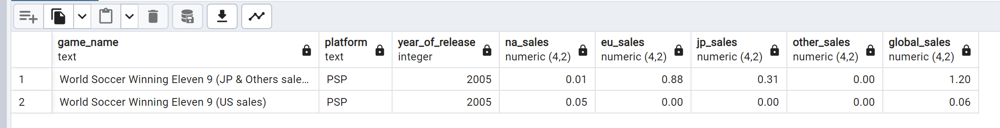

# Video Game Exploratory Data Analysis
## Introduction
This exploratory data analysis examines the video game industry, focusing on the performance of key players. By analyzing sales data and market trends, it provides a foundational understanding of the market. This analysis serves as a starting point for further in-depth investigations. 

## Project Description
The enitre analysis was produced with the help of the PostgreSQL RDBMS(Relational Database Management System) used for data management and the pgAdmin GUI(Graphical User Interface), which facilitated the interaction with the RDBMS.
The dataset was obtained from kaggle.com and contains the following columns: name, platform, year of release, genre, publisher, North America sales, Europe sales, Japan sales, other countries sales, global sales, critics score, critics count, users score, users count, developer and rating(ESRB). All sales are in millions of dollars. It's important to acknowledge that the overall quality of this analysis heavily depends on the quality of the data.
The project is divided into 2 phases with dedicated files: 
* Data Cleaning: This phase consists of handling missing data and normalization as to ensure minimmum redundancy for an easier and more reliable analysis.
* Exploratory Data Analysis: This phase provides basic statistical metrics for all of the variables and aims to asnwer questions regarding certain aspects of the data.

### Data Cleaning
Recommendation: To prevent potential issues, it's recommended to execute the script queries one at a time.

After the dataset is imported into PostrgreSQL, every column is checked for null values. Where there's no reliable way to infer the missing values, the tuples that contain them will be deleted.
While the game_name column had only two instances of missing values, it can be observed that there are tuples with additional information in the game_name column which indicate inconsistencies in the data.

The tuples with weekly sales, old sales or ones that depict only sales from a certain region for a game that has a separate row
for all of its sales will be deleted, while the ones with "All regions" in the game_name column will be updated to remove the explanation.
The rows that show sales of the same game but only for a certain region, as shown in the photo below, will be added up into one tuple.

After adding these tuples, some duplicate rows will be generated. These rows will be deleted along with the ones that show the sales of a game from a certain region but have no complementary tuples.

To address missing values in other key columns, the following approaches were used:
*Cross-referencing platforms: Missing data on release year, developer, and rating were filled by referencing the same game on other platforms.
*Extracting from other columns: Some release years were parsed from the game title column.
*Series inference: For games that are part of a series, alphabetical sorting allowed identification of consecutive entries, with missing developer and rating values being inferred from adjacent titles. Missing release years for games in a series were filled by averaging the years of neighboring games.
*Platform-based averages: Missing release years were replaced with the average release year of the respective platform.
*Dropping columns: Columns with substantial missing data (critic_score, critic_count, user_score, user_count) and limited analytical value were removed.
*Dropping rows: Rows with missing values that couldn't have been inferred were deleted.

Upon visual inspection, it can be observed that some game names still contain additional information in parentheses.
 
These will be updated to remove the extra details, except for 'Dance Dance Revolution' and 'World Soccer Winning Eleven 7 International', which have region-specific versions and will retain the additional info.
Also through visual inspection, an outlier was spotted(there is only one game released in 2020 while the second most recent year is 2017) and it was discovered that some games have "unknown" publishers which will be deleted.
 

### Normalization

This is the initial form of the database which is not in 1NF because the developer column has cells that depict multiple developers in a single row.

To bring the database into the first normal form another table was created containing the game_name, platform and developer columns where each row has only one developer.

After this separation the database is in 4NF due to there being no partial, transitive or multivalued dependencies. To bring the database into 5NF, the video_games table will be split into two tables: Games and Sales. The Sales table will contain the game_name, platform and year_of_release columns which represent the primary key and the variables depicting the sales in different regions, while the Games table will contain the same primary key and the columns that depict certain attributes of games.

In order to link the all of the tables together the game_version_id column was added to serve as the primary key for the Sales table and foreign key for the Developers table.

### Exploratory Data Analysis
The analysis starts by creating views of general statistics such as the number of entries and the most common value for the categorical variables and metrics such as mean, median, mode, standard deviation, quartiles and the range of the values for the numeric variables. These views were created in order to easily access theses values whenever when needed.
From this point on, the analysis will take the form of questions and answers and will be divided into 4 sections:
* Region-based analysis
* Time-based analysis
* Platform analysis
* Publishers analysis

#### Region-based analysis
According to the analysis, North America and Europe prefer Action, Sports, and Shooter genres, with Wii Sports being the top-selling game and Nintendo leading in both publishing and development. Japan, however, favors Role-Playing games, with Pokémon Red/Blue as the top-seller and Nintendo as the top publisher and developer. The "Other" regions lean towards Action, Sports, and Shooter games, with GTA: San Andreas as the best-seller, EA as the top publisher, and Nintendo as the top developer. Overall, North America has the highest total sales.

#### Time-based analysis
